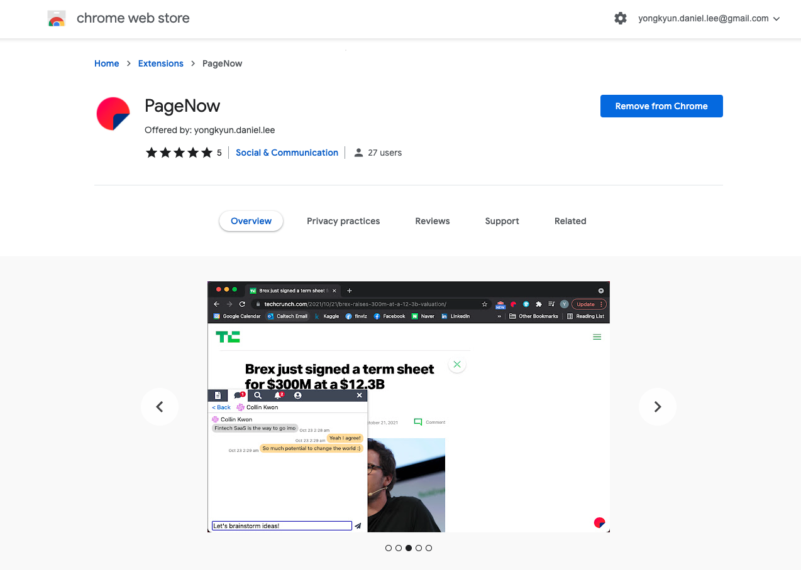

[한국어 README.md](./README_KO.md)

# PageNow Chrome Extension

PageNow Home Page: https://pagenow.io <br/>
PageNow Chrome Web Store: https://chrome.google.com/webstore/detail/pagenow/lplobiaakhgkjcldopgkbcibeilddbmc

## What is this repository for?

This repository contains code for the Chrome extension. The compressed file of the [build](./build/) directory is uploaded to the Chrome Web Store.

<p align="center">

</p>

## Overview

A Chrome extension is composed of two components: popup and content script. Popup is the screen that pops up when you click the extension icon. Content script is the script that lives in each page opened on the Chrome browser. PageNow Chrome extension is also composed of two components (popup and inject-script) and the output directory (build).

* [popup/](./popup/) contains the code that runs when the extension popup is opened.
* [inject-script](./inject-script) contains the code injected to each page (PageNow client and PageNow icon).
* [build](./build/) is the output directory that holds the built code of popup and inject-script. It also has core files, such as [mainfest.json](./build/manifest.json) and [background.js](./build/background.js)

## Local Configuration

The following should be configured for local development.

* `externally_connectable` in [build/manifest.json](./build/manifest.json) must include the localhost for the client running locally. It allows the Chrome extension to exchange messages between the injected client. For the default Angular app, it is `http://localhost:4200/*`.
* `CLIENT_URL` in [inject-script/src/shared/config.js](./inject-script/src/shared/config.js) must be set to the localhost endpoint. It provides the source address to host in the injected iframe.
* `CLIENT_URL` in [popup/src/shared/config.js](./popup/src/shared/config.js) must be set to the localhost endpoint to enable authentication flow.
* `USER_API_URL` in [popup/src/shared/config.js](./popup/src/shared/config.js) must be set to the endpoint of the user API. For the default Fast API server, it is `http://localhost:8000`.

## Build

Popup and injection scripts must be built before compressing.

Here are the steps to generate the final output to be uploaded to the Chrome web store.
1. Run ```npm run-script build``` inside [popup](./popup/) directory and [inject-script](./inject-script/) directory to build the extension.
2. Compress the `build/` folder and upload to Chrome extension.

## Chrome Web Store Deployment

There are some configurations that need to be checked before publishing the package to the Chrome store.

* Update `presenceWsHost` and `chatWsHost` to production endpoints in [build/background.js](./build/background.js).
* Update `externally_connectable` in [build/manifest.json](./build/manifest.json) so that *matches* array only contains `<PRODUCTION_CLIENT_URL>/*`.
* Update `CLIENT_URL` in `inject-script/src/shared/config.js`.
* Update `USER_API_URL`, `CLIENT_URL` in `popup/src/shared/config.js`.

After updating these configurations, follow the steps to build and upload the package via Chrome Web Store Developer Dashboard.

<p align="center">

</p>

## Notes

* Google accounts sign-in is forbidden in an iframe due to Google's policy. It is also forbidden in Chrome extension popup. Thus, we open a new tab upon Google authentication and sync across the web and extension.

* Websocket (wss) doesn't accept headers, so we need to pass it as query param and verify at Lambda function level.

* We get jwt using Amplify, but background.js does not use Amplify. Thus, we refresh jwt as frequently as possible to prevent jwt from being expired.
