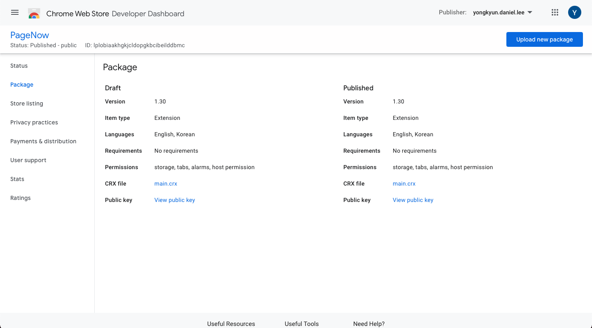

[English README.md](./README.md)

PageNow 홈페이지: https://pagenow.io <br/>
PageNow 크롬 웹스토어: https://chrome.google.com/webstore/detail/pagenow/lplobiaakhgkjcldopgkbcibeilddbmc

# PageNow 크롬 익스텐션

PageNow 크롬 익스텐션 레포지토리입니다. [build](./build/)를 압축하여 크롬 웹 스토어에 패키지로 등록하면 크롬 웹 스토어에 퍼블리싱 됩니다.

<p align="center">

</p>

## 개요

크롬 익스텐션 코드는 크게 popup과 content script로 구성되어 있습니다. Popup은 익스텐션 뱃지를 클릭하면 열리는 팝업 창이고, content script는 브라우저에 열려 있는 각 페이지에서 실행되는 코드입니다. PageNow 크롬 익스텐션 역시 popup과 inject-script로 구성되어 있습니다.

* [popup](./popup/)은 익스텐션 팝업이 열리면 작동하는 코드입니다.

* [inject-script](./inject-script)는 각 페이지에서 PageNow 클라이언트와 PageNow 아이콘을 삽입시키는 코드입니다. 클라이언트와 [background.js](./build/background.js) 사이의 메시지를 중개하는 역할도 수행합니다.

* [build](./build/)는 popup과 inject-script 코드를 빌드한 결과물과 함께 [mainfest.json](./build/manifest.json)과 [background.js](./build/background.js)와 같은 익스텐션의 주요 코드를 담고 있습니다.

## 로컬 설정

로컬 개발을 위해서 다음 설정을 확인해야 합니다.

* [build/manifest.json](./build/manifest.json)의 `externally_connectable`는 클라이언트의 로컬 호스트 주소를 포함해야 합니다. 이는 로컬 PageNow 클라이언트에게 크롬 익스텐션과 메시지를 교환할 수 있는 권한을 줍니다. Angular의 기본 설정값으로 로컬 클라이언트를 실행하면 `externally_connectable`의 `matches` 배열에 `http://localhost:4200/*`를 추가하면 됩니다.

* [inject-script/src/shared/config.js](./inject-script/src/shared/config.js)의 `CLIENT_URL`은 로컬에서 실행되는 PageNow 클라이언트의 주소(기본값은 *http://localhost:4200*)로 설정해야 합니다. 삽입된 아이프레임이 호스팅할 소스(source) 주소로 사용됩니다.

* [popup/src/shared/config.js](./popup/src/shared/config.js)의 `CLIENT_URL` 역시 위와 같은 로컬 주소로 설정해야 합니다. 이는 팝업의 사용자 인증 플로우에 필요합니다.

* [popup/src/shared/config.js](./popup/src/shared/config.js)의 `USER_API_URL`는 목표 User API의 주소로 설정해야 합니다. 로컬에서 실행하는 Fast API 서버의 주소 기본값은 *http://localhost:8000* 입니다.

## 크롬 웹스토어 패키지 배포 설정

아래는 익스텐션을 빌드 및 배포하기 전에 확인해야 할 설정 값입니다.

* [build/background.js](./build/background.js)의 `presenceWsHost`와 `chatWsHost`가 프로덕션 주소인지 확인

* [build/manifest.json](./build/manifest.json)의 `externally_connectable`의 `matches` 배열에 `<PRODUCTION_CLIENT_URL>/*`만 있는지 확인

* [inject-script/src/shared/config.js](./inject-script/src/shared/config.js)의 `CLIENT_URL` 값 확인.

* [popup/src/shared/config.js](./popup/src/shared/config.js)의 `USER_API_URL`과 `CLIENT_URL` 값 확인

## 빌드와 배포

다음 과정을 따라 크롬 웹 스토어에 익스텐션을 배포할 수 있습니다.

1. [popup/](./popup/) 디렉토리와 [inject-script/](./inject-script/) 디렉토리 안에서 ```npm run-script build```를 실행하여 `popup`과 `inject-script`를 빌드합니다.

2. [build](./build/) 디렉토리를 압축하여 `build.zip` 파일을 생성합니다.

3. 크롬 웹 스토어 개발자 대시보드에 `build.zip`을 업로드합니다. PageNow의 경우 업로드한 패키지가 승인되기까지 최소 2-3일 정도가 소요되었습니다.

<p align="center">

</p>

## 기타

* 현재는 아이프레임과 익스텐션 팝업에서 구글 로그인이 금지되어 있습니다. 따라서 팝업에서 구글 로그인 버튼을 누르면 클라이언트가 새로운 탭을 열어 클라이언트와 익스텐션 간 동기화를 시킵니다.

* 웹소켓(wss) 연결 시 헤더를 설정할 수 없기 때문에 jwt를 파라미터로 보낸 후 AWS Lambda Function에서 직접 인증합니다.

* Amplify를 통해 jwt를 받지만 background.js는 Amplify를 사용하지 않습니다. 따라서 background.js에 저장된 jwt가 만료되지 않도록 최대한 자주 jwt를 업데이트해야 합니다.
